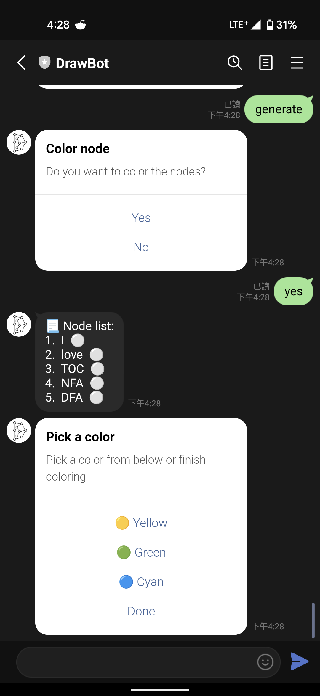
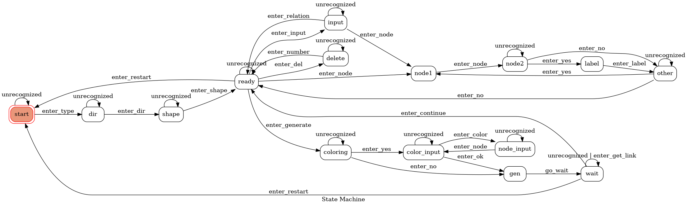

# DrawBot


A Line bot for drawing amazing graph with interactive messages! This project uses `Django` as the server framework to implement the Line bot.

Add the bot with the following QR code:

<div>
    <p style="text-align: center"></p>
</div>


## Demo

### Welcoming & Starting

<table style="display:flex;justify-content:space-around;padding-top:1em;">
    <tr>
    	<td style="text-align: center"></td>
        <td style="text-align: center"></td>
        <td style="text-align: center"></td>
    </tr>
    <tr>
    	<td style="text-align: center"><p>Welcoming & choose graph type</p></td>
        <td style="text-align: center"><p>Choose direction of graph</p></td>
        <td style="text-align: center"><p>Choose shape of nodes</p></td>
    </tr>
</table>

### Manipulation of relations

<table style="display:flex;justify-content:space-around;padding-top:1em;">
    <tr>
    	<td style="text-align: center"></td>
        <td style="text-align: center"></td>
        <td style="text-align: center"></td>
    </tr>
    <tr>
    	<td style="text-align: center"><p>Options</p></td>
        <td style="text-align: center"><p>Input</p></td>
        <td style="text-align: center"><p>Deletion</p></td>
    </tr>
</table>


### Interactive Input

<table style="display:flex;justify-content:space-around;padding-top:1em;">
    <tr>
    	<td style="text-align: center"></td>
        <td style="text-align: center"></td>
        <td style="text-align: center"></td>
        <td style="text-align: center"></td>
    </tr>
    <tr>
    	<td style="text-align: center"><p>Input node 1</p></td>
        <td style="text-align: center"><p>Input node 2</p></td>
        <td style="text-align: center"><p>Label to ther relation</p></td>
        <td style="text-align: center"><p>Other nodes?</p></td>
    </tr>
</table>

### Generation

<table style="display:flex;justify-content:space-around;padding-top:1em;">
    <tr>
    	<td style="text-align: center"></td>
        <td style="text-align: center"></td>
        <td style="text-align: center"></td>
        <td style="text-align: center"></td>
    </tr>
    <tr>
    	<td style="text-align: center"><p>Color nodes</p></td>
        <td style="text-align: center"><p>Choose color</p></td>
        <td style="text-align: center"><p>Choose nodes</p></td>
        <td style="text-align: center"><p>Generate & Wait</p></td>
    </tr>
</table>

## Quick Start

### Prerequisite

- Python version: 3.9.9
- The required pip packages are written in `requirements.txt`
- It is recommended to use pipenv to manage the packages

### Execution

- Check the webhook URL is included in `drawbot/settings.py`
- Run the following command to start server

```bash
$ python manage.py runserver
```


## Features

- **Easy to understand** - the bot is designed to have sufficient message to indicate what is going on now

- **Easy to share** - the generated graph is uploaded to [Imgur](imgur.com), you can get the image link and share to anyone

- **Highly customizable** - you can define the direction of graph, color and shape of the nodes

- **Flexibility of input methods**

  Consider different user might accustom to different way to input relations, the bot provides two ways to input relations!

  - Interactive mode:

    The bot will lead the user to add nodes and edges step by step with messages

  - Fast input mode:

    User can quickly add relations to graph with the specified syntax, for example

    ```
    a -b> c                     // relation for node a and node c with edge is b
    a -ab> b -> c -cd> d -> e   // specify a sequence of relations
    ```

    In this mode, user can add relations faster than interactive mode. Also, multiple line input and sequence of relations are allowed in this mode, which can further increase the input speed. You can even finish a graph with a single line if you find the Euler path of your graph!

## State Machine



The bot is designed to have 15 states to handle each user's status. Each user will have his / her own state machine. In the following sections, we'll have a look on the functionality of each states


### Basic graph setups

- states: *start*, *dir*, *shape*
- These states will determine the attributes of the generated graph. Including the direction of the graph (top-down or left-right), the shape of nodes and whether the graph is a *directed graph* or *undirected graph*

### Control state - ready

- Ready state is the main control state of most of the possible behaviors, the possible options as below:
  - Input relations
  - Delete relations
  - Generate graph
  - Give up the current inputs and restart the machine
- After the above actions were done, the machine will back to ready state to wait for the next action

### Relations manipulation

- Interactive input
  - states: *input*, *node1*, *node2*, *label*, *other*
  - After receive the command of adding relations the state will go to *node1* and *node2*, each state will add a node to the relation. 
  - User can decide if they want to add label name in the *label* state
  - For convenience, after a relation is added, user can decide to add other nodes the connected to *node1* to make faster input in the *other* state
- Fast input
  - states: *input*
  - After receive the specified syntax of relations, the machine will store those relations and back to ready state
- Delete relations
  - state: *delete*
  - The bot will list all possible relations, users can decide which relation they want to delete

### Generate Graph

- Coloring
  - states: *coloring*, *color_input*, *node_input*
  - Users decide if they want to color nodes in the *coloring* state
  - Then choose the color in the *color_input*
  - The chosen nodes in *node_input* state will be colored with the color pick in the *color_input* state
- Generate
  - states: *gen*, *wait*
  - After all information were claimed in the above states, the bot will generate the corresponding graph and go directly to *wait* state
  - In the *wait* state, users can decide if they want to do further modification to the graph or just restart and generate another graph